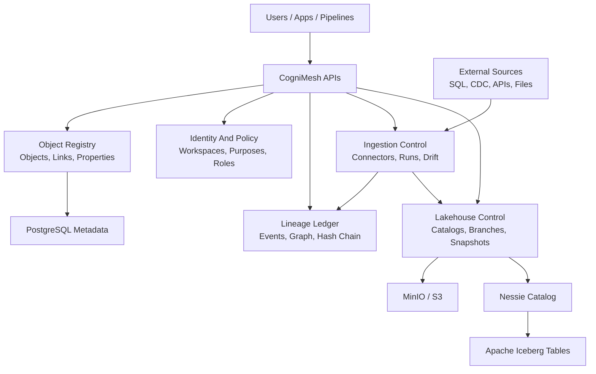

# CogniMesh

CogniMesh is an open-source, self-hosted enterprise data operating system inspired by public Palantir Foundry concepts. It is designed for teams that want a governed semantic data platform they can run on their own infrastructure without coupling storage, compute, metadata, applications, governance, lineage, and ML lifecycle into one proprietary black box.

CogniMesh is not affiliated with Palantir. The goal is not to copy a private product. The goal is to build an open architecture with similar enterprise-grade capabilities using Kubernetes-native services and widely adopted open-source technologies.

## What CogniMesh Is

CogniMesh is built around a governed Object Layer:

- Physical data lives in open storage such as S3-compatible object stores and Apache Iceberg tables.
- Compute engines such as DuckDB, Spark, and Trino are planned as separate execution backends.
- Semantic metadata is managed as Objects, Links, and Properties instead of exposing raw database schemas to every app.
- Access is purpose-aware, role-aware, workspace-aware, and auditable.
- Lineage records how data, metadata, jobs, policies, and object bindings change over time.
- Applications, dashboards, ML workflows, and operational actions are planned to consume the Object Layer rather than raw databases.

The project is being implemented module by module from the master plan in [plan.md](plan.md). A module is only marked complete after code, tests, docs, deployment wiring, and security gates pass.

## Current Status

CogniMesh is early but runnable locally. The completed modules are:

| Module | Status | What Exists |
| --- | --- | --- |
| 0 Project Foundation | Complete | Repository structure, ADRs, standards, CI scaffolding, task runner, validation gates |
| 1 Core Data Object Registry | Complete | FastAPI registry for Workspaces, Namespaces, Source Systems, Dataset Tables, Object Types, Properties, Links, REST, GraphQL, revisions, audit, seed domain |
| 2 Identity, Tenancy, And Policy | Complete | Development auth, OIDC boundary, service accounts, principals, workspace memberships, purposes, Casbin RBAC/ABAC, policy decision logs |
| 10 Lineage And Provenance Ledger | Complete | OpenLineage ingestion, asset graph, column lineage payloads, policy context capture, hash-chained ledger, DataHub/Marquez/OpenLineage exports |
| 5 Lakehouse Storage And Versioning | Complete | MinIO/S3 config, Nessie/Iceberg catalog config, Lakehouse Control API, branches, commits, merges, table snapshots, object bindings, retention, compaction, cost metadata, Kustomize base |
| 4 Data Connection And Ingestion | Complete | Ingestion Control API, connector catalogue, source definitions, local CSV/JSON/Parquet-pointer ingestion, sample API ingestion, Postgres CDC events, schema drift, retryable runs, OpenLineage payloads, Compose and Kustomize wiring |

Next module in build order: **Module 6 Compute And Query Engines**.

Modules not listed as complete are still planned work. See [plan.md](plan.md) for the full A-to-Z roadmap and tracking table.

## Architecture



The architecture deliberately separates:

- **Storage**: S3-compatible object storage and Iceberg table metadata.
- **Catalog/versioning**: Nessie-style branches, tags, commits, and merges.
- **Semantic layer**: Object Types, Properties, Links, and object-to-snapshot bindings.
- **Governance**: identity, purpose, roles, policy decisions, audit, and lineage.
- **Compute and apps**: planned modules that consume the object and lakehouse APIs.

## Implemented Services

### Object Registry

Path: [services/object-registry](services/object-registry)

The Object Registry is the semantic control plane. It registers source systems, physical dataset tables, object types, properties, and links. It exposes REST and GraphQL APIs, records revisions/audit events, and enforces policy on every route.

Local endpoints:

- REST/OpenAPI: `http://localhost:8000/docs`
- GraphQL: `http://localhost:8000/graphql`
- Health: `http://localhost:8000/health`

### Lakehouse Control

Path: [services/lakehouse-control](services/lakehouse-control)

Lakehouse Control manages the storage/versioning control plane. It tracks Iceberg-style catalogs, branches, commits, table snapshots, object snapshot bindings, retention jobs, compaction jobs, and estimated storage costs.

Local endpoints:

- REST/OpenAPI: `http://localhost:8010/docs`
- Health: `http://localhost:8010/health`
- MinIO Console: `http://localhost:9001`
- Nessie API: `http://localhost:19120`

### Ingestion Control

Path: [services/ingestion-control](services/ingestion-control)

Ingestion Control manages the data connection plane. It tracks connector definitions, source definitions, schema discovery, previews, ingestion runs, schema drift, retries, local raw landing envelopes, and OpenLineage-compatible run payloads. The default stack includes native local file, sample API, and Postgres CDC event paths, with Apache Hop, Meltano/Singer, Debezium, stream, NoSQL, and optional Airbyte boundaries registered for later execution modules.

Local endpoints:

- REST/OpenAPI: `http://localhost:8020/docs`
- Health: `http://localhost:8020/health`

## Local Development

### Prerequisites

- Docker Desktop or Docker Engine with Compose
- PowerShell
- Python 3.12+ for local validation outside containers
- Kubernetes and `kubectl` for rendering or applying Kustomize manifests

### Prepare Python Test Environment

The current local validators reuse the Object Registry virtual environment:

```powershell
powershell -ExecutionPolicy Bypass -File .\scripts\of.ps1 module1:install
```

### Start The Local Stack

```powershell
powershell -ExecutionPolicy Bypass -File .\scripts\of.ps1 compose:up
```

This starts:

- PostgreSQL
- Object Registry
- MinIO
- Nessie
- Lakehouse Control
- Ingestion Control

Stop the stack:

```powershell
powershell -ExecutionPolicy Bypass -File .\scripts\of.ps1 compose:down
```

### Validate The Repository

Run the complete validation gate for all completed modules:

```powershell
powershell -ExecutionPolicy Bypass -File .\scripts\of.ps1 test
```

Run individual gates:

```powershell
powershell -ExecutionPolicy Bypass -File .\scripts\of.ps1 check
powershell -ExecutionPolicy Bypass -File .\scripts\of.ps1 module1:check
powershell -ExecutionPolicy Bypass -File .\scripts\of.ps1 module2:check
powershell -ExecutionPolicy Bypass -File .\scripts\of.ps1 module4:check
powershell -ExecutionPolicy Bypass -File .\scripts\of.ps1 module5:check
powershell -ExecutionPolicy Bypass -File .\scripts\of.ps1 module10:check
```

Render the Kubernetes base:

```powershell
kubectl kustomize .\infra\kustomize\base
```

## Development Auth

Local development uses explicit headers. Production identity integration is planned around OIDC/Keycloak and policy services.

Platform admin example:

```http
X-CogniMesh-Actor: local-admin
X-CogniMesh-Roles: platform_admin
X-CogniMesh-Purpose: metadata_administration
```

Workspace-scoped example:

```http
X-CogniMesh-Actor: user:data-engineer
X-CogniMesh-Roles: data_engineer
X-CogniMesh-Workspace: <workspace-id>
X-CogniMesh-Purpose: pipeline_validation
```

Anonymous requests are denied for protected APIs. Health endpoints remain public for local and orchestration checks.

## Example API Flow

Object metadata:

```http
GET /v1/object-types
GET /v1/graph/search?query=employee
GET /v1/revisions/object_type/{object_type_id}
GET /v1/lineage/object_type/{object_type_id}
```

Lineage:

```http
POST /v1/lineage/openlineage
GET /v1/lineage/graph/dataset/{asset_id}
GET /v1/lineage/ledger/verify
GET /v1/lineage/events/{event_id}/datahub
```

Lakehouse:

```http
GET /v1/lakehouse/catalogs
POST /v1/lakehouse/catalogs/{catalog_id}/branches
POST /v1/lakehouse/tables
POST /v1/lakehouse/tables/{table_id}/snapshots
POST /v1/lakehouse/catalogs/{catalog_id}/branches/{source_branch}/merge
POST /v1/lakehouse/object-bindings
GET /v1/lakehouse/costs/datasets
```

Ingestion:

```http
GET /v1/ingestion/connectors
POST /v1/ingestion/sources
POST /v1/ingestion/sources/{source_id}/discover
POST /v1/ingestion/sources/{source_id}/preview
POST /v1/ingestion/sources/{source_id}/ingest
POST /v1/ingestion/sources/{source_id}/cdc/events
POST /v1/ingestion/runs/{run_id}/retry
GET /v1/ingestion/runs/{run_id}/lineage
```

## Repository Layout

```text
apps/          Future frontend apps and object-aware app integrations
docs/          Architecture notes, ADRs, engineering standards, operator docs
examples/      Future synthetic reference domains and demo data
infra/         Docker Compose, Kustomize, Helm, Terraform, local cluster assets
packages/      Future SDKs, generated clients, shared schemas, reusable libraries
scripts/       Project task runner and validation gates
services/      Backend services and service templates
tests/         Future contract, integration, end-to-end, and load tests
```

## Roadmap

Recommended build order from [plan.md](plan.md):

1. Project Foundation: complete
2. Core Data Object Registry: complete
3. Identity, Tenancy, And Policy Foundation: complete
4. Lineage And Provenance Ledger: complete
5. Lakehouse Storage And Versioning: complete
6. Data Connection And Ingestion: complete
7. Compute And Query Engines: next
8. Pipeline Builder And Code Workspaces
9. Semantic Modeling And dbt Integration
10. Object Query Service
11. Data Quality And Contracts
12. Low-Code App Builder Integration
13. Object Explorer, Object Views, And Analytics
14. Actions, Writeback, And Functions
15. ML And Model Lifecycle
16. Advanced Governance And Compliance
17. Kubernetes Production Platform
18. Observability, Reliability, And Operations
19. Backup, Restore, Migration, And Upgrade
20. SDKs, CLI, And Developer Experience
21. Reference Domains And Demo Apps
22. Planning, Optimization, And AI Tooling
23. Marketplace And Extension System
24. Security Hardening And Release Certification

## Design Principles

- Self-hosted first.
- Kubernetes-native, but locally runnable with Docker Compose.
- Storage, compute, and semantic layers are separate.
- Data assets must be versioned and lineage-aware.
- Governance is part of the API contract, not an afterthought.
- Prefer open formats and replaceable engines.
- Build one module at a time and keep the tracker honest.

## Documentation

Key docs:

- [Master plan](plan.md)
- [Architecture overview](docs/architecture/overview.md)
- [Identity, tenancy, and policy](docs/architecture/identity-policy.md)
- [Lineage and provenance ledger](docs/architecture/lineage-provenance-ledger.md)
- [Lakehouse storage and versioning](docs/architecture/lakehouse-storage-versioning.md)
- [Data connection and ingestion](docs/architecture/data-connection-ingestion.md)
- [Local development](docs/engineering/local-development.md)
- [Dependency and license policy](docs/engineering/dependency-license-policy.md)
- [Security policy](SECURITY.md)
- [Contributing guide](CONTRIBUTING.md)

## Contributing

CogniMesh is being built in strict module order. Before contributing code:

1. Read [plan.md](plan.md).
2. Check the current module in the Project Tracking Template.
3. Keep changes scoped to the active module unless a prerequisite fix is required.
4. Add or update tests and docs with the code.
5. Run `powershell -ExecutionPolicy Bypass -File .\scripts\of.ps1 test`.

## License

CogniMesh is released under the Apache License 2.0. See [LICENSE](LICENSE).
