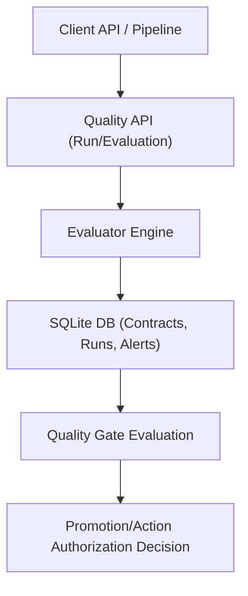

# Data Quality And Contracts

Module 11 introduces the Data Quality And Contracts control plane service (`quality-control`). This service defines, executes, and tracks quality contracts across physical datasets and semantic object types.

## Responsibilities

- **Contract Registry**: Store expectations (assertions) on tables and columns, defining allowed values, uniqueness, nullability, row counts, freshness bounds, schema shapes, and referential integrity.
- **Built-in Quality Evaluator**: Execute validations against inputs (rows) or external databases (via compute engine queries) to generate structured test results.
- **Run History & Audit**: Persist run outcomes, details, and execution timestamps to track quality over time.
- **Quality Gates**: Evaluate whether an asset satisfies a set of quality contracts for a specific lifecycle phase (for example, gating staging-to-curated promotion).
- **Incident & Alerting**: Raise alerts on contract failures with severity levels (`warning` or `error`) and track their lifecycle (active vs resolved).
- **Quality Score Calculation**: Provide a unified score (0-100%) indicating the proportion of active contracts currently passing.

## Flow



## Built-in Checks

The evaluator provides local Python-native evaluation for:
1. **`not_null`**: Verifies that a target column has zero null values.
2. **`unique`**: Verifies that all values in a target column are unique.
3. **`accepted_values`**: Verifies that column values belong to a predefined whitelist.
4. **`relationship_integrity`**: Checks that values in a source column exist in a target set of allowed values (referential check).
5. **`freshness`**: Checks that the dataset's update timestamp is within a threshold.
6. **`row_count_bounds`**: Ensures row count is within `min` and `max` bounds.
7. **`schema_match`**: Compares column names and database types against a target schema specification.

## API Surface

- `POST /v1/quality/contracts`: Define a contract.
- `GET  /v1/quality/contracts`: List contract definitions (filtered by asset/type).
- `GET  /v1/quality/contracts/{contract_id}`: Retrieve a contract.
- `DELETE /v1/quality/contracts/{contract_id}`: Remove a contract.
- `POST /v1/quality/runs`: Execute and record a quality checks run.
- `GET  /v1/quality/runs`: List run history.
- `POST /v1/quality/gates`: Register a quality gate.
- `GET  /v1/quality/gates`: List quality gates.
- `POST /v1/quality/gates/evaluate`: Evaluate if an asset satisfies its gates.
- `GET  /v1/quality/alerts`: List alerts.
- `POST /v1/quality/alerts/{alert_id}/resolve`: Mark an alert as resolved.
- `GET  /v1/quality/scores/{asset_id}`: Retrieve current quality score (percentage passing).

## Local Verification

Run:

```powershell
powershell -ExecutionPolicy Bypass -File .\scripts\of.ps1 module11:check
```
