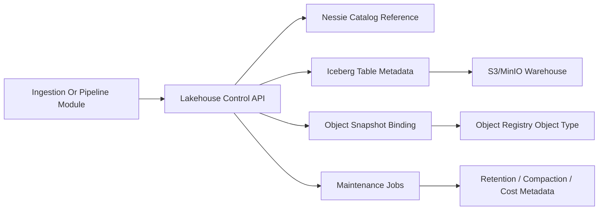

# Lakehouse Storage And Versioning

Module 5 introduces CogniMesh's lakehouse data plane foundation. It keeps storage, catalog versioning, and semantic object metadata decoupled:

- MinIO provides the local S3-compatible object store.
- Production deployments can replace MinIO with any S3-compatible endpoint.
- Project Nessie provides Git-like catalog references and exposes Iceberg REST capabilities.
- Apache Iceberg is the default table format contract for datasets.
- The Lakehouse Control service tracks dataset versions, branches, snapshots, object bindings, retention, compaction, and storage cost metadata.

## Control Plane Flow



The first implementation does not embed Spark, Trino, or pyiceberg execution. Those arrive in Modules 4 and 6. Module 5 provides the durable API and local infrastructure those engines need to store and promote Iceberg datasets safely.

## Lakehouse Zones

CogniMesh standardizes five storage zones:

- `raw`: immutable source-aligned landings.
- `staged`: validated data that is not yet trusted.
- `curated`: trusted analytics-ready datasets.
- `semantic`: backing tables for Object Layer object sets and marts.
- `feature`: model feature tables and feature views.

Every table belongs to exactly one zone. This keeps retention, promotion, and governance rules predictable.

## Branch And Promotion Workflow

1. A pipeline creates a branch from `main`.
2. The pipeline writes an Iceberg table snapshot on that branch.
3. Quality and policy checks validate the branch output.
4. The branch is merged into `main` only when validation is `passed` or `approved`.
5. The merge promotes the latest retained branch snapshots to the target branch.
6. An Object Type can bind to the promoted snapshot and catalog commit.

This mirrors Git-like development while preserving explicit dataset versions.

## Object Binding

The Object Registry remains the semantic source of truth. Lakehouse Control stores a binding that lets an Object Type reference:

- table id
- snapshot id
- catalog commit id
- branch name
- purpose and actor that created the binding

Later Object Query and dbt modules will use this binding to resolve Object Layer reads to concrete Iceberg snapshots.

## Maintenance

Retention and compaction are API-driven jobs:

- Retention can dry-run or expire older retained snapshots while protecting the current snapshot in safe mode.
- Compaction can dry-run the expected file reduction or create a new compacted snapshot.
- Both jobs write auditable job records with parameters and results.

The same API contract can be backed by local jobs, Kubernetes CronJobs, or workflow engines in later modules.

The Module 5 Kustomize base includes suspended dry-run CronJobs for retention and compaction. Operators must set real table ids and explicitly unsuspend them after validation.

## Cost Metadata

Each snapshot records size and estimated monthly storage cost. The dataset cost API aggregates retained snapshots by table and branch. Operators can change the estimate with:

```text
COGNIMESH_STORAGE_COST_PER_GB_MONTH
```

The default local estimate is `0.023` USD per GiB-month.

## Local Endpoints

When Compose is running:

- Lakehouse Control: `http://localhost:8010/docs`
- MinIO API: `http://localhost:9000`
- MinIO Console: `http://localhost:9001`
- Nessie API: `http://localhost:19120`

Run the module gate:

```powershell
powershell -ExecutionPolicy Bypass -File .\scripts\of.ps1 module5:check
```
