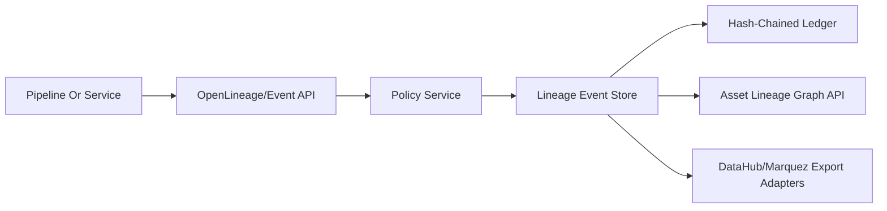

# Lineage And Provenance Ledger

Module 10 adds the first production-grade lineage slice for CogniMesh. It is implemented in the Object Registry because every later module needs a governed control-plane place to register lineage before dedicated metadata and catalog services are introduced.

## Responsibilities

- Ingest OpenLineage-compatible run events from pipelines, notebooks, dbt jobs, Spark jobs, and service-to-service automation.
- Store asset-level lineage for datasets, object types, properties, pipelines, applications, models, and actions.
- Record actor, run id, job identity, producer, code version, branch, input versions, output versions, column lineage, policy context, and event details.
- Maintain an append-only hash chain for lineage events so tampering is detectable.
- Expose policy-aware REST APIs for ingestion, graph lookup, ledger listing, ledger verification, and compatibility exports.
- Produce adapter payloads for Marquez/OpenLineage and DataHub-style metadata synchronization without requiring those systems for local development.

## Control Plane Flow



Every lineage write passes through the same request context and policy service used by object metadata APIs. The ledger stores a stable JSON payload hash containing the event id, asset reference, job/run metadata, inputs, outputs, version metadata, column lineage, policy context, and details. Each ledger record includes the previous record hash, producing a tamper-evident chain.

## API Surface

- `POST /v1/lineage/events`: create an CogniMesh-native lineage event.
- `POST /v1/lineage/openlineage`: ingest an OpenLineage-style event and normalize it to CogniMesh assets.
- `GET /v1/lineage/graph/{asset_kind}/{asset_id}`: fetch upstream and downstream asset dependencies.
- `GET /v1/lineage/ledger`: list ledger records in sequence order.
- `GET /v1/lineage/ledger/verify`: verify the hash chain.
- `GET /v1/lineage/events/{event_id}/openlineage`: export an OpenLineage-compatible payload.
- `GET /v1/lineage/events/{event_id}/datahub`: export a DataHub MetadataChangeProposal-like payload.
- `GET /v1/lineage/events/{event_id}/marquez`: export a Marquez/OpenLineage-compatible payload.

## Governance Model

Lineage APIs are authenticated. `platform_admin` can administer all lineage. `data_engineer` can create and inspect lineage, and verify the ledger for approved purposes. `auditor` can inspect lineage and verify the ledger. Service accounts can create and read lineage for automated jobs.

The event payload captures policy context at write time:

- purpose
- roles
- workspace id
- actor

This preserves why a lineage-producing action was allowed even if policy rules change later.

## Provenance Levels

The first implementation supports asset-level and column-level lineage payloads. Row-level and cell-level provenance are designed as future extensions rather than forced into the registry prematurely.

Planned row-level provenance:

- CDC connectors emit source primary keys, operation type, source transaction id, and source commit timestamp.
- Merge jobs write manifest references instead of one registry row per data row.
- Iceberg or Delta snapshots carry row-level provenance files in object storage.
- The Object Registry stores compact references to those manifests.

Planned cell-level provenance:

- Only enabled for regulated assets or explicit high-assurance domains.
- Stores column-level transformations plus row-manifest references.
- Uses external object storage for high-volume proof material.
- Registry keeps hashes, locations, policy purpose, and verification status.

## Integration Roadmap

- Module 4 connectors will emit CDC lineage into this API.
- Module 5 lakehouse versioning will add Iceberg/Nessie snapshot and branch references.
- Module 6 compute runtimes will emit Spark, DuckDB, and Trino lineage events.
- Module 8 dbt integration will translate dbt manifest and run artifacts into column lineage.
- Module 17 advanced governance will add propagation rules for purposes and sensitive classifications.
- Module 20 operations will export lineage metrics and alert on broken lineage chains.

## Local Verification

Run:

```powershell
powershell -ExecutionPolicy Bypass -File .\scripts\of.ps1 module10:check
```

The gate verifies the migration, API routes, lineage adapters, hash-chain logic, documentation, policy controls, and test coverage.
