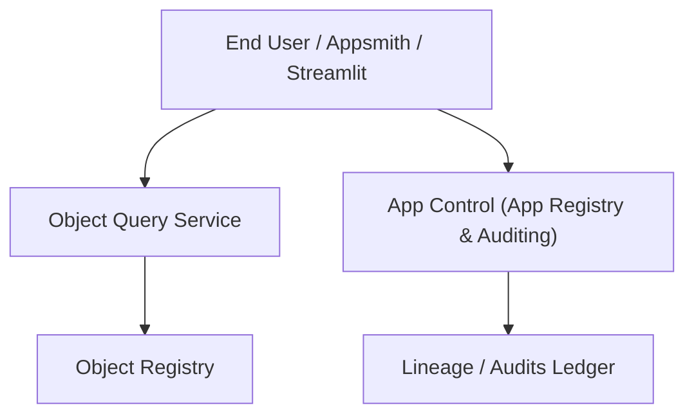

# Low-Code App Builder Integration

Module 13 enables building operational applications on the CogniMesh semantic Object Layer. It establishes the App Control control plane (`app-control`), a Python client SDK (`cognimesh-sdk`), and integration templates/examples for Appsmith and Streamlit.

## App Control Control Plane

The `app-control` service serves as the metadata registry, auditor, and deployment gatekeeper for applications.

### Key Capabilities

1. **App Registry**: Stores metadata for registered applications (name, workspace, declared purpose, owner, data dependencies, deployment URL).
2. **Deployment Verification**: Gates deployment/promotion of applications. Verifies that:
   - The app's declared purpose aligns with allowed security purposes.
   - The app's data dependencies are registered in the object registry.
   - The user/owner has sufficient permissions on those dependencies.
3. **App Auditing**: Captures and persists logs of user interactions within apps (who read what object for what purpose at what time).
4. **UI Component Contracts**: Registers schemas for UI components to ensure they conform to semantic Object Type structures.

## Python SDK and Streamlit Integration

The `cognimesh-sdk` is a lightweight Python client wrapper designed for building code-first operational apps (such as Streamlit dashboards).

- Provides a fluent query builder to interact with the Object Query Service (OQS).
- Handles context propagation (actor, workspace, purpose).
- Automatically logs query audits to `app-control`.

## Flow



## API Surface

- `POST /v1/apps`: Register a new application.
- `GET  /v1/apps`: List registered applications.
- `GET  /v1/apps/{app_id}`: Retrieve application registration.
- `POST /v1/apps/{app_id}/deploy`: Evaluate deployment gates and policies.
- `POST /v1/apps/{app_id}/audit`: Record user action/query audit logs.
- `GET  /v1/apps/{app_id}/audit`: List audit logs for an app.
- `POST /v1/apps/components`: Register an object-aware UI component contract.
- `GET  /v1/apps/components`: List registered UI component contracts.

## Local Verification

Run:

```powershell
powershell -ExecutionPolicy Bypass -File .\scripts\of.ps1 module13:check
```
