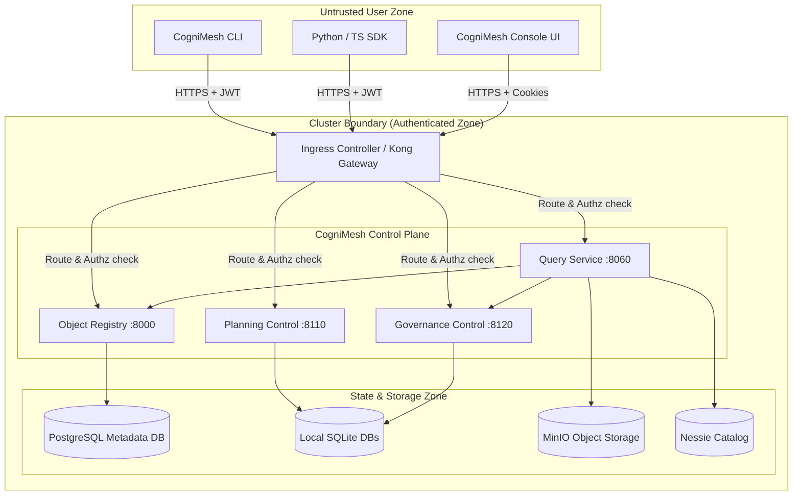

# STRIDE Threat Model

This document outlines the security architecture, trust boundaries, and key threat mitigations for the CogniMesh platform.

## Security Architecture & Trust Boundaries

## Threat Analysis (STRIDE)

| Threat Category | Potential Threat Scenario | Platform Mitigation |
| :--- | :--- | :--- |
| **Spoofing** | Unauthorized user spoofing an admin to register unsafe object schemas. | Mandatory OIDC authentication through Keycloak; JWT token verification at the API gateways and within individual service middlewares. |
| **Tampering** | Malicious actor tampering with Iceberg tables or Nessie catalogs directly. | Storage access only permitted via OQS (Object Query Service) and lakehouse control; direct database/MinIO credentials are not exposed to clients. |
| **Repudiation** | User executing object writeback actions, but denying they performed the operation. | Structured audit ledgers and OpenLineage events captured on every write or action invocation, linking operations to the authenticated user principal. |
| **Information Disclosure** | Unauthorized users reading PII data through OQS queries. | Column masking and row-level filtering applied dynamically via Governance Policy services prior to returning OQS query results. |
| **Denial of Service** | Flooding query service with recursive GraphQL queries or oversized requests. | Latency tracking middleware, request rate-limiting at ingress, and database connection pools with execution timeouts. |
| **Elevation of Privilege** | Standard employee user calling planning optimization API endpoints reserved for administrators. | Casbin-powered role-based and purpose-based access checks verified in the security middleware of each microservice. |

## Trust Boundaries Explained

1. **User Client to Gateway (Untrusted Boundary)**: All ingress traffic must be encrypted (HTTPS) and carry a valid Bearer JWT issued by the OIDC provider.
2. **Gateway to Control Plane (Semi-trusted Boundary)**: Gateway strips invalid requests and forwards authenticated headers. Services re-verify headers and apply Casbin policies.
3. **Control Plane to Storage (Trusted Boundary)**: Internal databases, Nessie catalog, and MinIO endpoints are located inside private network zones, accessible only via internal service credentials.
