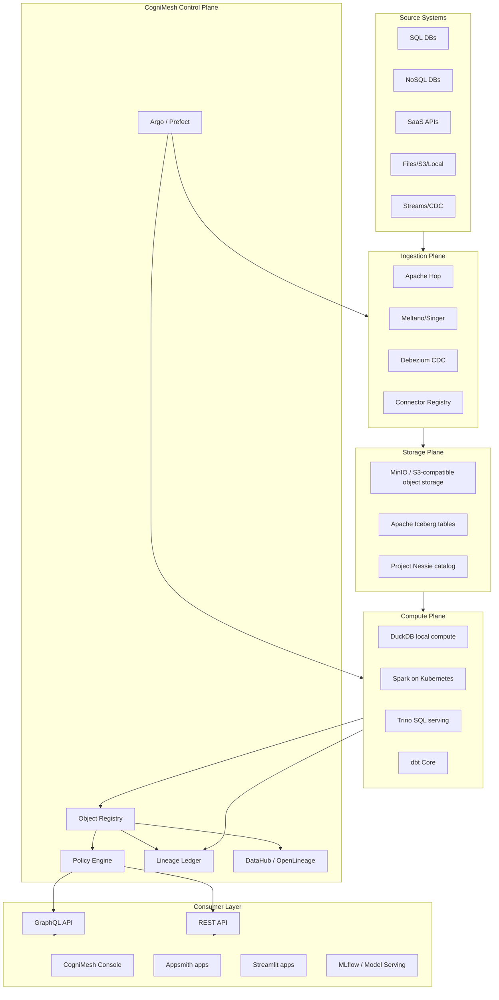

# CogniMesh Project Plan

Status: architecture and roadmap draft  
Date: 2026-06-09  
Role: open-source, self-hosted enterprise data operating system inspired by Palantir Foundry

## 1. Executive Summary

CogniMesh will be a Kubernetes-native, self-hosted enterprise data operating system. It will provide ingestion, lakehouse storage, distributed and local compute, metadata, semantic object modeling, governance, lineage, app-building, and ML lifecycle capabilities without requiring a proprietary SaaS control plane.

The central product idea is the **Object Layer**:

- Raw databases, files, lake tables, event streams, and APIs remain implementation details.
- Users and applications interact with semantic **Objects**, **Links**, **Properties**, **Actions**, **Purposes**, and **Policies**.
- All transformations, object mappings, access decisions, versions, and lineage events are tracked as first-class metadata.

The first build target is **Module 1: Core Data Object Registry**, a FastAPI service that registers physical data tables as semantic objects, stores relationships as a graph, and exposes REST and GraphQL APIs so frontend and app-builder clients can query objects without knowing the raw schema.

## 2. Important Research Boundary

This project is inspired by public Palantir Foundry product concepts, not by copying private implementation details. Palantir does not publicly disclose the full internal stack for Foundry. Public documentation confirms architectural concepts and product surfaces such as Ontology, Object Storage, Workshop, Slate, Pipeline Builder, Contour, Data Lineage, Actions, Functions, resource management, security markings, purpose-based controls, and supported compute/runtime categories.

Public docs indicate that Foundry/AIP supports broad data integration modes including batch, streaming, and CDC, and compute runtimes including Spark, Flink, DataFusion, Polars, DuckDB, and containerized bring-your-own engines. Public docs also emphasize the Ontology as the core abstraction for enterprise decisions, object-aware applications, actions, lineage graphs, branch-aware lineage, granular security, markings, purpose-based controls, and audit logging.

CogniMesh will implement an original open architecture that maps these public capabilities to open-source components.

## 3. Product North Star

CogniMesh should let a company self-host a complete operational data platform:

1. Connect to source systems.
2. Replicate raw data into an open lakehouse.
3. Build governed transformations.
4. Register physical tables as real-world semantic objects.
5. Query those objects through stable APIs.
6. Build operational dashboards and apps on the semantic layer.
7. Track every asset, version, policy, and lineage edge.
8. Run ML workflows and serve models against governed objects.
9. Deploy on a laptop, VM, bare-metal cluster, or Kubernetes.

## 4. Design Principles

- **Self-hosted by default:** every required component must run locally with Docker Compose and in production with Kubernetes.
- **Open protocols first:** REST, GraphQL, OpenAPI, OpenLineage, OpenTelemetry, OIDC, SQL, Iceberg REST Catalog, dbt artifacts, and standard container images.
- **Decoupled storage, compute, and semantics:** object storage/table formats store data; Spark/DuckDB/Trino/Flink compute on it; CogniMesh Object Registry defines meaning and access.
- **Semantic layer is the product boundary:** app builders and dashboards must query the Object API, not raw databases.
- **GitOps where possible:** metadata, dbt models, pipeline definitions, policies, and Helm configuration are text artifacts that can be reviewed.
- **Policy enforcement is central:** every read/write path checks purpose, role, attribute, row, and column policy.
- **Lineage is not decoration:** lineage is mandatory metadata emitted by ingestion, transformation, object registration, and model pipelines.
- **Cost-aware architecture:** laptop mode uses DuckDB/Postgres/MinIO; enterprise mode scales Spark/Flink/Trino/Kubernetes only when needed.
- **License-aware defaults:** core CogniMesh should remain truly open-source. Source-available or open-core tools can be optional adapters, not hard dependencies.

## 5. Palantir Foundry Public Pillars To CogniMesh Mapping

| Foundry-style capability | Public Foundry concept | CogniMesh default | Optional adapters | Notes |
| --- | --- | --- | --- | --- |
| Data connection and ingestion | Data Connection, Magritte-like ingest, batch, streaming, CDC | Apache Hop, Meltano/Singer, Debezium, Kafka-compatible Redpanda | Airbyte | Airbyte has strong connector coverage but license risk because parts use Elastic License v2; keep it optional. |
| Visual pipeline and compute | Pipeline Builder, Contour builds, transforms, code workbooks | Apache Spark, DuckDB, Trino, dbt Core, Argo Workflows or Prefect | Flink, Polars, DataFusion, Ray | Spark for distributed jobs, DuckDB for local/small data, Trino for federated SQL. |
| Transactional lakehouse storage | Foundry datasets, object storage/indexing, branch-aware assets | Apache Iceberg, Project Nessie, MinIO/S3-compatible object storage | Delta Lake, lakeFS | Iceberg + Nessie gives table/catalog-level Git-like branching; lakeFS can version raw object-store paths. |
| Semantic Object Layer | Ontology, object types, link types, properties, actions, Object Storage V2 | CogniMesh Object Registry, dbt Core, DataHub metadata graph | Amundsen, OpenMetadata | Registry is source of truth for semantic API; DataHub handles broad metadata discovery/governance. |
| Object-aware apps | Object Views, Object Explorer, Workshop, Slate, Quiver | CogniMesh Console, Appsmith integration, Streamlit SDK | ToolJet | Appsmith is Apache-2.0; ToolJet is AGPL and should stay optional. |
| Actions and writeback | Ontology Actions and edits | Action Registry, rule engine, object writeback API | Temporal, Cadence, custom function runtime | Later phase. First build read-oriented object registry. |
| ML/model lifecycle | Vertex, Foundry ML, model functions | MLflow Tracking/Registry, ZenML, KServe/BentoML, Argo/Prefect | Feast feature store, Seldon | Models consume Object API and emit predictions back as object properties or linked objects. |
| Security and governance | Role, marking, purpose-based controls, audit logs | Keycloak OIDC, Casbin, Apache Ranger, OpenLineage, DataHub, immutable audit ledger | OPA, SPIFFE/SPIRE | Casbin enforces API policy; Ranger enforces engine/lake policies where supported. |
| Lineage | Data Lineage graph, branch-aware lineage, node history/code/schema/job specs | OpenLineage, Marquez/DataHub, lineage ledger, SQL/dbt parser | OpenMetadata lineage | Start table/job-level; progress to column, row, and high-assurance cell-level provenance. |
| Deployment and operations | Apollo-like platform deployment | Helm, Kustomize, Argo CD/Flux, OpenTelemetry, Prometheus, Grafana, Loki | Crossplane, Terraform | No proprietary deployment plane required. |

## 6. Recommended Default Stack

### Core Platform

- Backend language: Python 3.12 for control-plane services; TypeScript for frontend.
- API framework: FastAPI.
- GraphQL: Strawberry GraphQL or Ariadne.
- Database: PostgreSQL for transactional metadata.
- Graph backend: PostgreSQL adjacency model first; optional Neo4j adapter for graph-heavy deployments.
- Authentication: Keycloak OIDC.
- Authorization: Casbin for service-level RBAC/ABAC; Apache Ranger for lake/query-engine enforcement when integrated.
- Event bus: Redpanda or Kafka for CDC and lineage events.
- Observability: OpenTelemetry, Prometheus, Grafana, Loki, Tempo.

### Data Plane

- Object storage: MinIO locally; S3-compatible storage in production.
- Table format: Apache Iceberg first.
- Catalog/versioning: Project Nessie for Git-like catalog branching; Iceberg REST Catalog compatibility.
- Local compute: DuckDB.
- Distributed compute: Spark on Kubernetes.
- SQL query serving: Trino.
- Transform modeling: dbt Core.
- Workflow orchestration: Prefect for Python-native development and Argo Workflows for Kubernetes-native execution.

### Semantic and Metadata

- CogniMesh Object Registry: canonical semantic object model.
- DataHub: enterprise data catalog, ownership, glossary, lineage visualization, broad metadata ingestion.
- OpenLineage: common lineage event format.
- Marquez: lightweight lineage backend for local/dev mode if DataHub is too heavy.

### App and ML Layer

- CogniMesh Console: purpose-built web console for object registry, graph, lineage, and policy management.
- Appsmith: default low-code app builder integration because it is Apache-2.0.
- Streamlit SDK: code-first operational data apps.
- MLflow: experiment tracking, model registry, and model artifacts.
- KServe or BentoML: production model serving.
- ZenML: optional ML pipeline framework when teams want a higher-level MLOps abstraction.

## 7. License Strategy

CogniMesh itself should use **Apache License 2.0** unless the project later decides to use AGPL for stronger reciprocity. Apache-2.0 gives enterprises the least friction for self-hosted adoption and plugin development.

Default dependencies should prefer Apache-2.0, MIT, BSD, or similarly permissive OSI-approved licenses. Tools with source-available, open-core, or network-copyleft licensing can still be supported through isolated adapters:

- Airbyte: useful connector ecosystem, but parts use Elastic License v2. Keep optional.
- ToolJet: AGPL-3.0. Keep optional and communicate obligations clearly.
- Appsmith: Apache-2.0. Good default for low-code integration.
- Apache Hop, Spark, Iceberg, Ranger, Kafka-compatible tools, OpenLineage, and many CNCF tools fit better with the default open-source posture.

## 8. Logical Architecture



## 9. Core Domain Model

CogniMesh metadata should be built around these primitives:

- **Workspace:** tenant or organizational boundary.
- **Namespace:** domain boundary such as HR, Finance, Supply Chain, Security.
- **Source System:** external system of record, file store, API, or stream.
- **Dataset Table:** physical table or view in a database, lakehouse catalog, or virtual/federated query engine.
- **Object Type:** semantic entity/event type such as Employee, Order, Facility, Aircraft, Ticket, Shipment.
- **Object Property:** typed semantic property mapped to a physical column, computed expression, model output, vector, timeseries, or struct.
- **Link Type:** semantic relationship between two object types, backed by foreign keys, join tables, graph edges, or object-backed relationships.
- **Object Instance:** row-level semantic entity resolved from backing data. The registry should not always copy full data; it should resolve through governed query services or materialized indexes.
- **Action Type:** governed writeback operation that can create, modify, delete, or link objects.
- **Purpose:** declared use of data such as Payroll, Fraud Detection, Marketing, Clinical Care, Research, Export Control.
- **Policy:** RBAC/ABAC rule controlling who can perform which action on which object/property/row for which purpose.
- **Lineage Event:** immutable record connecting inputs, outputs, transform code, runtime, user/service identity, policy context, and version.
- **Asset Version:** immutable revision for metadata and pointer to data snapshot, catalog commit, or lakeFS commit.

## 10. Data Versioning Strategy

CogniMesh needs two levels of versioning:

1. **Metadata versioning:** object definitions, properties, links, policies, pipeline specs, dbt models, and app definitions are versioned as immutable revisions. The registry stores revision history and supports draft, active, deprecated, and archived states.
2. **Data versioning:** lakehouse tables use Iceberg snapshots, branches, tags, and Nessie catalog commits. Raw object paths can optionally use lakeFS for Git-like repository semantics at object-store level.

Every object type should be able to answer:

- Which physical dataset snapshot backs this object?
- Which registry revision defined the object at that time?
- Which pipeline/job generated or updated it?
- Which policies and purposes were active?
- Which downstream assets consumed it?

## 11. Governance And Security Model

### Identity

- Keycloak issues OIDC/JWT tokens.
- JWT claims include subject, groups, roles, tenant/workspace, and optional purpose grants.
- Service accounts are first-class identities with scoped permissions.

### Authorization

- Casbin enforces API-level RBAC/ABAC.
- Apache Ranger enforces table/column policies in engines that support it.
- CogniMesh Query Service rewrites object queries to enforce column masks and row predicates before executing SQL.
- Deny-by-default for unclassified or unregistered assets.

### Purpose-Based Access Control

Each read or write request must declare a purpose. Policies determine whether the subject can use the requested object, property, link, or action for that purpose.

Purpose propagation rules:

- A downstream asset inherits the effective restrictions of upstream inputs.
- Sensitive tags such as PII, PHI, PCI, export-controlled, or trade secret propagate unless a documented transform de-identifies or aggregates the data.
- Declassification requires an approved transform, test evidence, owner approval, and lineage record.
- Appsmith/Streamlit apps must bind to an allowed purpose at deployment time.

### Row/Column/Cell Controls

- Module 1 starts with object/property-level policy metadata and API hooks.
- Later phases add column masking and row predicate enforcement in the query service.
- Cell-level lineage is expensive and should be reserved for critical regulated assets. The planned approach is stable row identity plus column transform lineage plus hash-chain/Merkle commitments for input/output cell values where required.

## 12. Lineage Architecture

CogniMesh lineage should evolve in levels:

1. **Level 1: Asset/job lineage:** jobs, input datasets, output datasets, code version, run id, actor, timestamp.
2. **Level 2: Column lineage:** SQL/dbt parsing, Spark logical plans, OpenLineage facets, property-to-column mappings.
3. **Level 3: Row lineage:** CDC event ids, stable primary keys, input row hashes, output row hashes, merge/update/delete provenance.
4. **Level 4: Cell lineage:** property-level transform expressions, source cell hash commitments, output cell hash commitments, Merkle proofs for high-assurance audits.

Default local stack:

- OpenLineage event API.
- Marquez or DataHub as lineage backend.
- CogniMesh Lineage Ledger as an append-only audit stream with hash-chained records.

## 13. Cost Optimization Plan

### Local/Laptop Mode

- Run only Postgres, Object Registry, MinIO, DuckDB, and optional Marquez.
- Avoid Spark, Trino, DataHub, Keycloak, and Kafka until needed.
- Use DuckDB for table previews, CSV/Parquet exploration, and small transformations.
- Store samples and metadata, not full duplicated data.

### Small Team Mode

- Single VM or k3s cluster.
- MinIO for object storage.
- Postgres for metadata.
- Nessie for catalog branching.
- Prefect for workflows.
- Spark only as on-demand jobs.
- Appsmith and Streamlit as optional app runtimes.

### Enterprise Mode

- Kubernetes with autoscaling node pools.
- Spark-on-Kubernetes for distributed jobs.
- Trino for shared SQL.
- DataHub for metadata and lineage.
- Keycloak for SSO.
- Prometheus/Grafana/Loki/Tempo for observability.
- KEDA or cluster autoscaler for burst workloads.
- Spot/preemptible compute for retryable Spark jobs.
- Tiered object storage and lifecycle policies for old snapshots.
- Iceberg compaction and snapshot expiration jobs.
- Query result caching and data skipping to control compute spend.

### Cost Guardrails

- Every job has resource requests/limits and cost tags.
- Every dataset tracks storage size, snapshot count, and downstream consumers.
- Default retention policies expire old staging snapshots.
- Pipeline previews run on samples with DuckDB.
- Full distributed jobs require explicit promotion.
- Apps query the Object API with pagination, projections, and caching.

## 14. Repository Strategy

CogniMesh should be a monorepo with clear service boundaries:

```text
CogniMesh/
  plan.md
  README.md
  LICENSE
  docs/
    architecture/
    adr/
    user-guides/
    operator-guides/
  services/
    object-registry/
    policy-engine/
    lineage-ledger/
    query-service/
    ingestion-orchestrator/
    pipeline-builder/
    ml-lifecycle/
    api-gateway/
  apps/
    console/
    appsmith-templates/
    streamlit-examples/
  packages/
    sdk-python/
    sdk-typescript/
    common-openapi/
    common-protos/
  integrations/
    dbt/
    datahub/
    openlineage/
    hop/
    meltano/
    airbyte-optional/
    mlflow/
  infra/
    compose/
    helm/
    kustomize/
    terraform/
    kind/
  examples/
    employee-domain/
    retail-domain/
    healthcare-domain/
  tests/
    contract/
    e2e/
    load/
```

For Module 1, only `services/object-registry`, `infra/compose`, docs, and tests need to exist.

## 15. Module Roadmap

### Module 1: Core Data Object Registry

Goal: register physical tables as semantic objects and expose object graph APIs.

Key capabilities:

- Register source systems and physical tables.
- Define object types with properties mapped to table columns.
- Define link types between objects.
- Store object graph metadata in PostgreSQL.
- Optionally mirror graph edges into Neo4j.
- Expose REST and GraphQL APIs.
- Track metadata revisions.
- Emit initial OpenLineage-compatible events.
- Provide policy hooks, even if full enforcement lands later.

### Module 2: Ingestion And Connector Plane

Goal: land source data into raw lakehouse zones.

Key capabilities:

- Apache Hop project execution.
- Meltano/Singer connector execution.
- Debezium-based CDC for Postgres/MySQL/MongoDB where appropriate.
- Connector registry and secrets management.
- Raw zone write to Iceberg/Parquet.
- Source schema discovery and drift detection.

### Module 3: Lakehouse Storage And Catalog

Goal: transactional, versioned, branchable data assets.

Key capabilities:

- MinIO/S3 storage abstraction.
- Iceberg table creation and maintenance.
- Nessie catalog branches/tags/commits.
- Optional Delta Lake.
- Snapshot retention and compaction.
- Data asset version registry.

### Module 4: Compute And Pipeline Builder

Goal: build low-code and code-native transformations.

Key capabilities:

- Visual DAG builder using a portable CogniMesh Pipeline IR.
- IR compilers to SQL, dbt models, PySpark jobs, and DuckDB jobs.
- Preview mode using DuckDB samples.
- Production mode using Spark/Trino/Argo/Prefect.
- Pipeline versioning and promotion.
- Runtime lineage emission.

### Module 5: Semantic Modeling And dbt Integration

Goal: convert raw/staged tables into governed domain objects.

Key capabilities:

- Import dbt manifest/catalog/run_results artifacts.
- Map dbt models to Object Types.
- Sync dbt tests to Object Registry data contracts.
- Generate object/property documentation from dbt docs.
- Push object metadata to DataHub.
- Compute column lineage from dbt dependency graph and SQL parsing.

### Module 6: Object Query Service

Goal: provide governed object-set querying.

Key capabilities:

- Query objects by semantic names, not table names.
- Search around links and related objects.
- Filter, aggregate, sort, paginate, and project properties.
- Enforce row/column/purpose policies.
- Compile object queries to SQL for Trino, Postgres, DuckDB, or Spark.
- Support object views, dashboards, apps, and ML feature access.

### Module 7: Low-Code/No-Code App Builder Integration

Goal: build apps against the Object Layer.

Key capabilities:

- Appsmith datasource plugin/config templates for CogniMesh REST/GraphQL.
- Streamlit SDK with typed object clients.
- App deployment metadata tied to purposes.
- App-level audit logging.
- Templates for object detail pages, approval workflows, dashboards, and operational queues.

### Module 8: Governance, Policy, And Lineage

Goal: enforce enterprise controls end to end.

Key capabilities:

- Keycloak SSO.
- Casbin policy management.
- Ranger integration for Trino/Spark/Hive-compatible engines.
- Purpose registry and propagation.
- Sensitive data classification.
- Immutable lineage ledger.
- Data contracts and quality checks.
- Audit search and export.

### Module 9: ML And Operational AI Lifecycle

Goal: make models first-class object-layer citizens.

Key capabilities:

- MLflow tracking and registry.
- Model input/output schema tied to Object Types.
- Batch scoring pipelines.
- Live serving endpoints with KServe/BentoML.
- Evaluation jobs and drift checks.
- Predictions written back as object properties or linked Prediction objects.
- Automated retraining loops with lineage and approvals.

### Module 10: Production Operations

Goal: reliable self-hosted platform operations.

Key capabilities:

- Helm chart.
- Kustomize overlays.
- Backup/restore runbooks.
- HA Postgres guidance.
- Secrets management with External Secrets or SOPS.
- Observability dashboards.
- Upgrade/migration framework.
- Security hardening guide.
- Air-gapped install bundle.

## 16. Module 1 Detailed Plan: Core Data Object Registry

### 16.1 Objective

Build the first independently useful CogniMesh service:

- A FastAPI backend.
- PostgreSQL-backed metadata store.
- Optional Neo4j graph adapter.
- REST and GraphQL APIs.
- Docker Compose local hosting.
- Seed data showing `Employee`, `Department`, and `Project` objects.

### 16.2 Module 1 Directory Structure

Planned structure:

```text
CogniMesh/
  plan.md
  README.md
  services/
    object-registry/
      README.md
      pyproject.toml
      Dockerfile
      alembic.ini
      app/
        __init__.py
        main.py
        core/
          config.py
          logging.py
          security.py
        db/
          session.py
          base.py
          migrations/
        models/
          workspace.py
          source_system.py
          dataset_table.py
          object_type.py
          object_property.py
          link_type.py
          policy.py
          lineage.py
          revision.py
        schemas/
          common.py
          source_system.py
          dataset_table.py
          object_type.py
          object_property.py
          link_type.py
          graph.py
        repositories/
          source_system_repository.py
          object_type_repository.py
          graph_repository.py
          revision_repository.py
        services/
          registry_service.py
          graph_service.py
          revision_service.py
          policy_service.py
          lineage_service.py
        api/
          rest/
            router.py
            health.py
            sources.py
            tables.py
            objects.py
            links.py
            graph.py
          graphql/
            schema.py
            queries.py
            mutations.py
            types.py
        adapters/
          graph/
            base.py
            postgres_graph.py
            neo4j_graph.py
          lineage/
            openlineage.py
        seed/
          employee_domain.py
      tests/
        unit/
        integration/
        contract/
  infra/
    compose/
      docker-compose.yml
      .env.example
      postgres/
        init.sql
```

### 16.3 Module 1 Local Compose Services

Initial local hosting should include:

- `object-registry`: FastAPI service.
- `postgres`: primary metadata database.
- `neo4j`: optional graph backend profile, disabled by default for low-cost local mode.
- `pgadmin` or `adminer`: optional database browser.

Later compose profiles can add:

- `keycloak`
- `marquez`
- `datahub`
- `minio`
- `nessie`
- `trino`

### 16.4 Module 1 Data Model

Minimum tables:

- `workspaces`
- `namespaces`
- `source_systems`
- `dataset_tables`
- `dataset_columns`
- `object_types`
- `object_type_revisions`
- `object_properties`
- `link_types`
- `policies`
- `lineage_events`
- `audit_events`

Important modeling decisions:

- `object_types.api_name` is the stable API identifier, for example `Employee`.
- `object_properties.api_name` is the semantic name, for example `emailAddress`.
- `object_properties.source_column_name` maps to a physical column.
- `link_types` may be backed by a foreign key, join table, or computed relationship.
- Every object type and link type has status: `draft`, `active`, `deprecated`, or `archived`.
- Every metadata mutation creates a revision event.
- Every registry object belongs to a namespace and workspace.

### 16.5 Module 1 REST API

Initial endpoints:

```text
GET    /health
GET    /ready

POST   /v1/workspaces
GET    /v1/workspaces

POST   /v1/namespaces
GET    /v1/namespaces

POST   /v1/source-systems
GET    /v1/source-systems
GET    /v1/source-systems/{source_system_id}

POST   /v1/dataset-tables
GET    /v1/dataset-tables
GET    /v1/dataset-tables/{dataset_table_id}

POST   /v1/object-types
GET    /v1/object-types
GET    /v1/object-types/{object_type_id}
PATCH  /v1/object-types/{object_type_id}
GET    /v1/object-types/{object_type_id}/properties
POST   /v1/object-types/{object_type_id}/properties

POST   /v1/link-types
GET    /v1/link-types
GET    /v1/link-types/{link_type_id}

GET    /v1/graph/object-types/{object_type_id}
GET    /v1/graph/search

GET    /v1/revisions/{asset_kind}/{asset_id}
GET    /v1/lineage/{asset_kind}/{asset_id}
```

### 16.6 Module 1 GraphQL API

Initial GraphQL queries:

```graphql
type Query {
  objectType(id: ID, apiName: String): ObjectType
  objectTypes(namespace: String, status: ObjectStatus): [ObjectType!]!
  linkType(id: ID, apiName: String): LinkType
  objectGraph(rootObjectTypeId: ID!, depth: Int = 1): ObjectGraph!
  searchObjectTypes(query: String!): [ObjectType!]!
}
```

Initial GraphQL mutations:

```graphql
type Mutation {
  registerSourceSystem(input: SourceSystemInput!): SourceSystem!
  registerDatasetTable(input: DatasetTableInput!): DatasetTable!
  registerObjectType(input: ObjectTypeInput!): ObjectType!
  addObjectProperty(objectTypeId: ID!, input: ObjectPropertyInput!): ObjectProperty!
  createLinkType(input: LinkTypeInput!): LinkType!
  deprecateObjectType(objectTypeId: ID!, reason: String!): ObjectType!
}
```

### 16.7 Module 1 Example Domain

Seed example:

- Source system: `hr_postgres`.
- Dataset table: `public.employees`.
- Object type: `Employee`.
- Properties: `employeeId`, `fullName`, `emailAddress`, `departmentId`, `employmentStatus`, `hireDate`.
- Object type: `Department`.
- Link type: `EmployeeBelongsToDepartment`, many Employees to one Department.
- Object type: `Project`.
- Link type: `EmployeeAssignedToProject`, many-to-many through assignment table.

This gives us a compact but realistic test bed for metadata registration, graph traversal, and app-builder queries.

### 16.8 Module 1 Policy Hooks

Module 1 should include policy metadata but does not need full row filtering yet.

Required fields:

- `classification_tags`: for example `pii`, `internal`, `restricted`.
- `allowed_purposes`: for example `payroll`, `workforce_planning`.
- `owner_group`.
- `steward_group`.
- `default_access`: `deny`, `read_metadata`, or `read_data`.

Every API handler should call a placeholder `PolicyService.authorize(...)` so enforcement can be strengthened later without changing the API surface.

### 16.9 Module 1 Acceptance Criteria

Module 1 is done when:

- `docker compose up` starts the registry and Postgres.
- Migrations create the metadata schema.
- Seed script creates the Employee domain.
- REST API can create/list/get object types, properties, links, graph neighbors, lineage, and revisions.
- GraphQL API can fetch object types and object graph.
- OpenAPI docs are available from FastAPI.
- Unit and integration tests pass.
- Every metadata mutation creates a revision.
- Every metadata mutation writes an audit event.
- Basic policy hook exists on all read/write endpoints.
- README explains local setup and example API calls.

## 17. Pipeline Builder Intermediate Representation

Later modules should avoid tying the visual builder directly to Spark or SQL. Use a portable IR:

```yaml
pipeline:
  apiName: employee_headcount_by_department
  inputs:
    - objectType: Employee
  nodes:
    - id: active_employees
      type: filter
      expression: employmentStatus = 'ACTIVE'
    - id: group_by_department
      type: aggregate
      groupBy: [departmentId]
      metrics:
        - name: employeeCount
          function: count
  outputs:
    - dataset: analytics.employee_headcount_by_department
      objectType: DepartmentHeadcount
```

IR compilers:

- SQL compiler for Trino/DuckDB/Postgres.
- PySpark compiler for large distributed transforms.
- dbt compiler for governed transformation projects.
- OpenLineage emitter for runtime lineage.

## 18. CogniMesh Object Query Language

Later modules should expose an object-first query abstraction:

```json
{
  "from": "Employee",
  "purpose": "workforce_planning",
  "select": ["employeeId", "fullName", "department.name"],
  "where": {
    "employmentStatus": "ACTIVE"
  },
  "searchAround": [
    {
      "link": "EmployeeBelongsToDepartment",
      "select": ["name", "costCenter"]
    }
  ],
  "limit": 100
}
```

The Query Service compiles this to governed SQL, applies policy filters/masks, executes through the selected engine, and returns object-shaped JSON.

## 19. Deployment Strategy

### Development

- Docker Compose for local services.
- Makefile or task runner for common commands.
- Pre-commit hooks for formatting, linting, and tests.
- Seed datasets in `examples/`.

### Testing

- Unit tests per service.
- Contract tests for REST/GraphQL APIs.
- Integration tests using Compose.
- End-to-end tests for seeded domains.
- Policy tests for access control.
- Lineage tests to verify emitted graph edges.

### Production

- Helm chart for Kubernetes.
- Separate control-plane and data-plane namespaces.
- External Postgres option.
- External object store option.
- External Keycloak option.
- GitOps deployment with Argo CD or Flux.
- Network policies.
- Pod security standards.
- Backup and restore jobs.

## 20. Observability And Reliability

Each service must emit:

- Structured JSON logs.
- OpenTelemetry traces.
- Prometheus metrics.
- Health and readiness endpoints.
- Audit events for user-visible mutations.

Core SLO candidates:

- Object Registry API p95 latency under 200 ms for metadata reads in small/medium deployments.
- Graph traversal p95 under 500 ms for depth 2 on 100k object/link types.
- Metadata write durability with no lost audit/revision events.
- Policy decision latency under 20 ms with cached policies.

## 21. Backup And Disaster Recovery

Minimum production backup plan:

- Postgres logical backups for control-plane metadata.
- Object store bucket versioning or backup replication.
- Nessie catalog backup.
- Keycloak realm export.
- Helm values and GitOps repo as desired-state backup.
- Regular restore tests.

Recovery objectives should be configurable:

- Community/small team: daily backups, best-effort restore.
- Enterprise: hourly or continuous backups, documented RPO/RTO.

## 22. Community And Ecosystem Plan

CogniMesh should be useful even if users adopt only one part.

Public interfaces:

- REST/OpenAPI.
- GraphQL schema.
- Python SDK.
- TypeScript SDK.
- Connector SDK.
- Policy plugin interface.
- Object query language spec.
- Pipeline IR spec.
- OpenLineage facets.

Community assets:

- Example domains.
- Appsmith templates.
- Streamlit templates.
- dbt starter project.
- Helm quickstart.
- Architecture decision records.
- Contributor guide.
- License and dependency policy.

## 23. Key Risks And Mitigations

| Risk | Impact | Mitigation |
| --- | --- | --- |
| Scope is too large | Project never reaches usable state | Build vertical slices; Module 1 first; defer app builder, ML, and cell lineage. |
| Foundry clone trap | Legal/product confusion | Build original OSS architecture; use public concepts only; avoid Palantir names in code. |
| License mismatch | Enterprise adoption blocked | Keep default stack OSI-friendly; isolate ELv2/AGPL adapters. |
| Policy bypass | Security failure | Route apps through Object API; deny direct raw DB access in templates; add query-service enforcement. |
| Cell-level lineage overhead | High compute/storage cost | Implement levels; reserve cell lineage for classified/high-value assets. |
| Graph scale in Postgres | Slow graph queries | Start Postgres; add Neo4j adapter and caching when needed. |
| Connector maintenance burden | Poor ingestion coverage | Use existing Hop/Meltano/Debezium ecosystems; build connector SDK later. |
| Kubernetes complexity | Hard self-hosting | Compose first, k3s guide second, full Helm third. |

## 24. First Three Implementation Milestones

### Milestone 1: Object Registry Skeleton

- Create service structure.
- FastAPI app with health checks.
- Postgres connection.
- Alembic migrations.
- SQLAlchemy models.
- Docker Compose.
- Seed Employee domain.

### Milestone 2: Object Graph APIs

- REST CRUD for sources, tables, object types, properties, links.
- Graph traversal in PostgreSQL.
- GraphQL schema.
- Revision and audit events.
- Tests.

### Milestone 3: Governance Hooks

- Policy metadata fields.
- Casbin model stub.
- JWT-ready security layer.
- OpenLineage event adapter.
- DataHub/OpenLineage integration design.
- Documentation and examples.

## 25. Initial Technology Decisions

| Decision | Choice | Rationale |
| --- | --- | --- |
| Primary backend | FastAPI | Fast, typed, OpenAPI-native, Python ecosystem fits data tooling. |
| Metadata DB | PostgreSQL | Reliable, cheap, easy local hosting, enough for initial graph adjacency. |
| Graph backend | PostgreSQL first, Neo4j optional | Reduces local cost and operational complexity while preserving graph escape hatch. |
| GraphQL library | Strawberry or Ariadne | Python-native GraphQL over FastAPI. |
| Migrations | Alembic | Standard SQLAlchemy migration tool. |
| ORM | SQLAlchemy 2.x | Mature, async-capable, typed enough for service layer. |
| Validation | Pydantic v2 | FastAPI standard. |
| Table format | Apache Iceberg | Open table format, multi-engine support, snapshot/version features. |
| Catalog versioning | Project Nessie | Git-like semantics for data lake catalogs. |
| Local compute | DuckDB | Very low-cost analytics and previews. |
| Distributed compute | Spark on Kubernetes | Mature distributed data processing. |
| App builder | Appsmith first | Strong self-hosted low-code fit with Apache-2.0 licensing. |
| Metadata catalog | DataHub | Rich metadata, governance, lineage, APIs. |
| Lineage standard | OpenLineage | Open event model and ecosystem integrations. |

## 26. Research Sources

Palantir public docs:

- [Palantir Platform overview](https://palantirfoundation.org/docs/foundry/platform-overview/overview)
- [Palantir AIP architecture overview](https://palantirfoundation.org/docs/foundry/architecture-center/aip-architecture)
- [Palantir Ontology type reference](https://palantirfoundation.org/docs/foundry/object-link-types/type-reference)
- [Palantir Ontologies overview](https://palantirfoundation.org/docs/foundry/ontologies/ontologies-overview)
- [Palantir Ontology-aware applications](https://palantirfoundation.org/docs/foundry/ontology/applications)
- [Palantir Data Lineage navigation](https://palantirfoundation.org/docs/foundry/data-lineage/navigation)
- [Palantir Resource Management usage types](https://palantirfoundation.org/docs/foundry/resource-management/usage-types)
- [Palantir protecting sensitive data](https://www.palantir.com/docs/foundry/security/protecting-sensitive-data/)
- [Palantir Action rules](https://palantirfoundation.org/docs/foundry/action-types/rules)

Open-source ecosystem docs:

- [Apache Hop architecture](https://hop.apache.org/docs/architecture/)
- [Apache Hop metadata types](https://hop.apache.org/manual/latest/metadata-types/index.html)
- [Airbyte data replication platform](https://docs.airbyte.com/platform/)
- [Airbyte connector docs](https://docs.airbyte.com/integrations/)
- [Airbyte license update](https://airbyte.com/blog/update-on-airbytes-license)
- [Apache Spark docs](https://spark.apache.org/documentation)
- [DuckDB docs](https://duckdb.org/docs)
- [Apache Iceberg docs](https://apache.github.io/iceberg/docs/latest/)
- [Apache Iceberg branching and tagging](https://apache.github.io/iceberg/docs/latest/branching/)
- [Apache Iceberg REST Catalog spec](https://iceberg.apache.org/rest-catalog-spec/)
- [Delta Lake docs](https://docs.delta.io/)
- [Project Nessie introduction](https://projectnessie.org/guides/introduction/)
- [lakeFS docs](https://docs.lakefs.io/)
- [dbt Developer Hub](https://docs.getdbt.com/)
- [DataHub docs](https://docs.datahub.com/)
- [OpenLineage docs](https://openlineage.io/docs/next/)
- [Apache Ranger](https://ranger.apache.org/)
- [Casbin supported models](https://casbin.org/docs/supported-models/)
- [Appsmith docs](https://docs.appsmith.com/)
- [Appsmith GitHub license](https://github.com/appsmithorg/appsmith)
- [ToolJet app builder overview](https://docs.tooljet.com/docs/app-builder/overview)
- [ToolJet GitHub license](https://github.com/ToolJet/ToolJet)
- [Streamlit docs](https://docs.streamlit.io/)
- [MLflow docs](https://mlflow.org/docs/latest/)
- [ZenML docs](https://docs.zenml.io/)
- [Argo Workflows docs](https://argo-workflows.readthedocs.io/)
- [Prefect docs](https://docs.prefect.io/)

## 27. Next Action

After this plan is reviewed, the next build step is **Phase 0 and Module 1**. Phase 0 creates the project foundation, repository standards, local developer workflow, and architecture decision records. Module 1 creates the first real product service: the Core Data Object Registry.

The rest of this document defines the complete A-to-Z project completion plan. Use it as the master checklist to decide whether CogniMesh is only partially built, MVP-complete, or enterprise-complete.

## 28. Master Completion Model

CogniMesh should be judged at three levels:

| Completion level | Meaning | Required modules |
| --- | --- | --- |
| Developer Preview | A developer can run the control plane locally, register semantic objects, inspect the object graph, and query metadata through REST/GraphQL. | 0, 1, partial 2, partial 10, partial 19 |
| MVP Platform | A small team can ingest data, store it in a lakehouse, transform it, register objects, query through the semantic layer, enforce basic policies, view lineage, and build a basic app. | 0-14, 19, 20, 22 |
| Enterprise Complete | A company can run CogniMesh in production with HA, SSO, governed object APIs, app building, ML lifecycle, auditability, backups, upgrades, cost controls, SDKs, and documented operations. | 0-24 |

Completion is not "all code exists." A module is complete only when its APIs, tests, docs, deployment path, security model, observability, and upgrade path are also complete.

## 29. Foundry-Style Capability Parity Matrix

This matrix maps public Foundry-style capabilities to CogniMesh modules and defines what "complete" means for each area.

| Foundry-style area | CogniMesh capability | CogniMesh modules | Completion signal |
| --- | --- | --- | --- |
| Data Connection / Magritte | Connector registry, batch ingest, CDC ingest, schema discovery, secret handling | 4 | SQL, NoSQL, SaaS/API, file, and CDC sources can land into raw lakehouse zones with lineage. |
| Pipeline Builder | Visual DAG builder, pipeline IR, SQL/dbt/PySpark compilers, preview and production execution | 7 | A visual graph can generate executable code, run locally or on Kubernetes, and emit lineage. |
| Contour / analysis | Object Explorer, notebook/query workspace, charts, aggregations, saved analyses | 14 | Users can analyze object sets and publish read-only analyses without raw schema knowledge. |
| Code Workspaces | Code-native IDE workflow, Git-backed projects, job packaging | 7, 19 | Engineers can build and promote dbt/Spark/Python jobs with tests and review workflow. |
| Object Storage / Ontology | Object types, links, properties, actions, interfaces, object query API | 1, 8, 9, 12 | Real-world entities are modeled once and consumed by APIs, apps, actions, and ML. |
| Object Views | Object detail pages, linked object navigation, history, metrics | 14 | Each object type can render a generated detail view and relationship view. |
| Object Explorer | Search, filter, search-around, object-set operations | 9, 14 | Users can build object sets visually and query related objects. |
| Workshop | Low-code operational app builder over Object API | 13 | Apps query objects, trigger actions, respect purpose policies, and can be deployed. |
| Slate-like custom apps | Developer-built apps with SDKs and UI components | 13, 19 | React/Streamlit/custom apps can use typed SDKs and object-aware components. |
| Actions | Governed writeback, rules, approvals, side effects | 12 | Users can create/edit/link objects through policy-controlled actions with audit and lineage. |
| Functions | Server-side functions bound to objects/actions/apps | 12, 16 | Functions can compute values, validate actions, call external systems, and emit audit events. |
| Data Lineage | Asset, column, row, and optional cell lineage | 10 | Lineage graph shows upstream/downstream, versions, code, runs, policies, and branches. |
| Security Markings / PBAC | Purpose registry, classifications, row/column policies, propagation | 2, 10, 17 | Policies are enforced consistently at API and query layers and propagate downstream. |
| Vertex / ML | MLflow, model registry, batch/live serving, evaluation, retraining | 15 | Models consume object-layer data and write governed predictions back to the object layer. |
| Gaia / operational planning | Scenario planning, optimization jobs, geospatial/time-aware apps | 16 | Planning workflows can simulate changes and produce governed recommendations. |
| Apollo-like deployment | Helm, GitOps, upgrades, health, backup, air-gapped install | 18, 20, 21 | Operators can deploy, upgrade, monitor, backup, restore, and secure CogniMesh. |
| Marketplace / ecosystem | Templates, connectors, domain packs, app packs | 23 | Users can install reusable modules without forking the core platform. |

## 30. Full A-to-Z Module Checklist

Status legend:

- `Not Started`: no implementation yet.
- `Planned`: design accepted, no production code.
- `In Progress`: implementation exists but acceptance criteria are incomplete.
- `Complete`: code, tests, docs, deployment, observability, and security gates are done.

Current status: Modules 0, 1, 2, 10, and 5 are complete. Module 4 Data Connection And Ingestion is next according to the recommended build order. All later modules remain not started until the tracker marks their dependencies complete.

| Module | Name | Status | Depends on | Primary output |
| --- | --- | --- | --- | --- |
| 0 | Project Foundation | Complete | None | Repo, standards, ADRs, CI, local workflow |
| 1 | Core Data Object Registry | Complete | 0 | Object/link/property registry with REST/GraphQL |
| 2 | Identity, Tenancy, And Policy Foundation | Complete | 0, 1 | OIDC, workspaces, RBAC/ABAC, purpose model |
| 3 | Metadata Catalog And Search | Not Started | 1, 2 | DataHub/OpenLineage sync, search, glossary |
| 4 | Data Connection And Ingestion | Not Started | 0, 2, 10 | Connectors, CDC, batch ingest, schema discovery |
| 5 | Lakehouse Storage And Versioning | Complete | 0, 2, 10 | MinIO/S3, Iceberg, Nessie, snapshots, branches |
| 6 | Compute And Query Engines | Not Started | 5 | DuckDB, Spark, Trino, execution profiles |
| 7 | Pipeline Builder And Code Workspaces | Not Started | 1, 5, 6, 10 | Visual DAG, pipeline IR, dbt/Spark/SQL compilers |
| 8 | Semantic Modeling And dbt Integration | Not Started | 1, 3, 6, 7 | dbt import, object mapping, data contracts |
| 9 | Object Query Service | Not Started | 1, 2, 6, 8 | Governed object-set query API |
| 10 | Lineage And Provenance Ledger | Complete | 0, 1, 2 | OpenLineage events, graph, hash ledger |
| 11 | Data Quality And Contracts | Not Started | 5, 7, 8, 10 | Assertions, tests, freshness, anomaly checks |
| 12 | Actions, Writeback, And Functions | Not Started | 1, 2, 9, 10 | Governed edits, rules, approvals, function runtime |
| 13 | Low-Code App Builder Integration | Not Started | 2, 9, 12 | Appsmith/Streamlit integrations and templates |
| 14 | Object Explorer, Object Views, And Analytics | Not Started | 3, 9, 13 | Object search, detail pages, charts, saved analyses |
| 15 | ML And Model Lifecycle | Not Started | 5, 6, 8, 9, 10 | MLflow, serving, evaluation, retraining |
| 16 | Planning, Optimization, And AI Tooling | Not Started | 9, 12, 15 | Scenario planning, optimization, object-aware tools |
| 17 | Advanced Governance And Compliance | Not Started | 2, 9, 10, 11 | PBAC propagation, row/column/cell controls, evidence |
| 18 | Kubernetes Production Platform | Not Started | 0-17 as needed | Helm, GitOps, HA, autoscaling, network policy |
| 19 | SDKs, CLI, And Developer Experience | Not Started | 1, 9, 12 | Python/TypeScript SDKs, CLI, API docs |
| 20 | Observability, Reliability, And Operations | Not Started | 0, 18 | Metrics, traces, logs, runbooks, SLOs |
| 21 | Backup, Restore, Migration, And Upgrade | Not Started | 18, 20 | DR workflows, migrations, compatibility tests |
| 22 | Reference Domains And Demo Apps | Not Started | 1, 4, 7, 9, 13 | Employee, retail, supply chain, healthcare demos |
| 23 | Marketplace And Extension System | Not Started | 19, 22 | Connector/app/domain packs, plugin registry |
| 24 | Security Hardening And Release Certification | Not Started | 0-23 | Threat model, SBOM, scans, release checklist |

## 31. Module 0: Project Foundation

Purpose: create the engineering base that every other module uses.

Deliverables:

- Repository scaffold with `services/`, `apps/`, `packages/`, `infra/`, `docs/`, `examples/`, and `tests/`.
- `README.md`, `LICENSE`, `CONTRIBUTING.md`, `SECURITY.md`, `CODE_OF_CONDUCT.md`.
- Architecture decision record folder in `docs/adr/`.
- Coding standards for Python, TypeScript, Docker, SQL, and YAML.
- CI pipeline for linting, tests, dependency scanning, and Docker builds.
- Local task runner for setup, test, format, seed, compose up/down.
- Dependency and license policy.
- Versioning policy for APIs, database migrations, and SDKs.

Completion criteria:

- A new contributor can clone the repo and run one command to start the developer environment.
- CI runs on every pull request.
- All core service templates have health checks, logging, config loading, and tests.
- ADRs exist for the default stack choices: FastAPI, Postgres, Iceberg, Nessie, DuckDB, Spark, Trino, DataHub, OpenLineage, Keycloak, Casbin, Appsmith, MLflow.

## 32. Module 1: Core Data Object Registry

Purpose: define the semantic object model and expose it through REST and GraphQL.

Deliverables:

- FastAPI service in `services/object-registry`.
- PostgreSQL metadata schema and Alembic migrations.
- Object Types, Object Properties, Link Types, Source Systems, Dataset Tables, Namespaces, Workspaces.
- Revision history for object definitions.
- Audit events for metadata mutations.
- PostgreSQL graph traversal adapter.
- Optional Neo4j adapter behind a graph interface.
- REST API and GraphQL API.
- Seed Employee domain.
- OpenAPI docs and example requests.

Completion criteria:

- Users can register `Employee`, `Department`, and `Project` objects from physical tables.
- Users can define object links and fetch a depth-limited object graph.
- REST and GraphQL return equivalent object metadata.
- Every create/update/delete writes revision and audit records.
- Integration tests run against Postgres in Docker Compose.
- Policy hooks exist on every endpoint, even if full enforcement is added later.

## 33. Module 2: Identity, Tenancy, And Policy Foundation

Purpose: establish the security model before real data flows through the system.

Deliverables:

- Workspace and tenant isolation model.
- Keycloak OIDC integration.
- Service account model.
- JWT validation middleware.
- Casbin policy engine integration.
- RBAC model: platform admin, workspace admin, data engineer, data steward, app builder, analyst, ML engineer, auditor, service account.
- ABAC attributes: workspace, namespace, owner group, classification, purpose, environment, region.
- Purpose registry: declare and approve purposes such as payroll, fraud detection, customer support, research.
- Policy decision logs.
- Initial admin APIs for roles, groups, purposes, and policies.

Completion criteria:

- Anonymous requests are denied except health endpoints.
- A user can belong to multiple workspaces with different roles.
- API responses are scoped by workspace.
- Policy tests cover allow, deny, role inheritance, purpose mismatch, and service account access.
- Policy decisions are audit logged with subject, action, resource, purpose, and result.

## 34. Module 3: Metadata Catalog And Search

Purpose: make metadata discoverable across object registry, lakehouse, pipelines, and BI/apps.

Deliverables:

- DataHub integration adapter.
- Optional lightweight local metadata mode using Postgres search.
- Business glossary model.
- Ownership and stewardship model.
- Tags and classifications.
- Full-text search over objects, properties, datasets, pipelines, models, and apps.
- Metadata ingestion from dbt artifacts, OpenLineage events, Iceberg catalog, and object registry.
- Search API and UI-ready result schema.

Completion criteria:

- Searching `employee email` returns object properties, datasets, owners, and classifications.
- DataHub receives object type and dataset metadata.
- Glossary terms can be attached to object properties.
- Metadata search respects workspace and policy boundaries.
- Search indexes can be rebuilt from source metadata.

## 35. Module 4: Data Connection And Ingestion

Purpose: connect external sources and land raw data into governed storage.

Deliverables:

- Connector Registry service.
- Source definition model for SQL, NoSQL, SaaS APIs, local files, object storage, and streams.
- Secret references through environment/local secrets first, later External Secrets/Vault.
- Apache Hop integration for visual/batch pipelines.
- Meltano/Singer integration for ELT connectors.
- Debezium integration for CDC.
- Optional Airbyte adapter behind a license-aware integration boundary.
- Schema discovery, sample preview, and drift detection.
- Raw landing conventions: `raw/{source}/{schema}/{table}`.
- Ingestion run history and lineage events.

Completion criteria:

- Postgres CDC source can replicate inserts/updates/deletes into raw Iceberg or Parquet.
- CSV/JSON/Parquet local file ingest works in local mode.
- At least one SaaS/API connector path works through Meltano/Singer or a custom sample connector.
- Schema changes are detected and reported.
- Failed ingests are retryable and observable.
- Every ingest emits OpenLineage-compatible events.

## 36. Module 5: Lakehouse Storage And Versioning

Purpose: provide transactional, versioned, open storage for datasets.

Deliverables:

- MinIO local object store.
- S3-compatible production configuration.
- Apache Iceberg table management.
- Project Nessie catalog integration.
- Branch, tag, commit, and merge workflows for data assets.
- Raw, staged, curated, semantic, and feature zones.
- Snapshot retention and cleanup jobs.
- Compaction jobs.
- Optional lakeFS adapter for raw file-level versioning.
- Dataset version API.

Completion criteria:

- Ingested data can be stored as Iceberg tables.
- Users can create a data branch, run a pipeline, validate output, and promote/merge.
- Every object type can reference a backing dataset snapshot or catalog commit.
- Snapshot expiration and compaction run safely in local and Kubernetes modes.
- Storage cost metadata is visible per dataset and branch.

## 37. Module 6: Compute And Query Engines

Purpose: separate compute from storage and support both small/local and large/distributed workloads.

Deliverables:

- DuckDB execution adapter for local previews and small jobs.
- Spark-on-Kubernetes execution adapter for distributed jobs.
- Trino execution adapter for interactive SQL and object queries.
- Execution profile model: local, small, standard, high-memory, GPU, scheduled, streaming.
- Job packaging and image selection.
- Result materialization and temporary table management.
- Resource limits and cost tags.

Completion criteria:

- A transformation can run on DuckDB locally and Spark in production from the same logical pipeline.
- Trino can query Iceberg tables through the catalog.
- Jobs record resource usage, logs, inputs, outputs, and status.
- Failed jobs expose error messages and retry options.
- Compute engines emit lineage events.

## 38. Module 7: Pipeline Builder And Code Workspaces

Purpose: provide both low-code DAG building and code-native engineering workflows.

Deliverables:

- CogniMesh Pipeline IR spec.
- Visual DAG editor backend API.
- Node types: source, select, filter, join, union, aggregate, window, deduplicate, validate, write, branch, custom SQL, custom Python.
- Compiler to SQL.
- Compiler to dbt model definitions.
- Compiler to PySpark.
- Preview execution using DuckDB sample data.
- Production execution through Argo Workflows or Prefect.
- Git-backed project export/import.
- Pipeline versioning and promotion.
- Code workspace templates for dbt, PySpark, Python, and SQL.

Completion criteria:

- A visual pipeline can transform raw employees into a curated department headcount table.
- Generated code is readable, versioned, and testable.
- Users can preview on sample data before launching a full job.
- Pipeline runs create output datasets, lineage, logs, and quality results.
- Pipeline definitions can be reviewed through Git.

## 39. Module 8: Semantic Modeling And dbt Integration

Purpose: connect analytics engineering models to the Object Layer.

Deliverables:

- dbt project adapter.
- Import dbt `manifest.json`, `catalog.json`, and `run_results.json`.
- Map dbt sources and models to Dataset Tables.
- Map dbt models to Object Types.
- Convert dbt tests to data contracts.
- Convert dbt docs to object/property descriptions.
- dbt lineage ingestion.
- Object model validation rules.
- Interface support for common shapes across object types.
- Shared property/value type support.

Completion criteria:

- Running dbt produces metadata that appears in CogniMesh.
- A dbt model can become a backing table for an Object Type.
- dbt tests are visible as quality checks.
- Object model validation catches missing primary keys, duplicate API names, broken links, and type mismatches.
- Metadata is pushed to DataHub or local catalog.

## 40. Module 9: Object Query Service

Purpose: make semantic objects queryable without exposing raw schemas to consumers.

Deliverables:

- Object Query Language.
- Query compiler to Trino SQL.
- Query compiler to DuckDB/Postgres for local mode.
- Object-set filters, search, sort, pagination, projection.
- Link traversal and search-around queries.
- Aggregations and grouped metrics.
- Row-level policy rewrite.
- Column masking and property suppression.
- Query audit logs.
- Query result caching.
- REST and GraphQL object data APIs.

Completion criteria:

- A client can query `Employee` objects and traverse to `Department` without knowing table names.
- Purpose-based access is enforced before query execution.
- Row filters and column masks are applied consistently.
- Query plans are inspectable for debugging.
- The service supports large result pagination safely.
- SDKs can call the query API with typed responses.

## 41. Module 10: Lineage And Provenance Ledger

Purpose: provide trustworthy lineage for data, metadata, jobs, policies, apps, and ML.

Deliverables:

- OpenLineage event ingestion endpoint.
- Marquez/DataHub sync adapter.
- CogniMesh append-only lineage ledger.
- Hash-chained audit records for critical events.
- Asset-level lineage graph.
- Column-level lineage parser for SQL/dbt.
- Spark plan lineage integration where feasible.
- Row-level provenance design for CDC and merge jobs.
- Optional high-assurance cell-level lineage for regulated assets.
- Branch-aware lineage for Nessie/Iceberg branches.

Completion criteria:

- Users can view upstream and downstream dependencies for a dataset, object type, property, pipeline, app, or model.
- Lineage includes run id, code version, input version, output version, actor, timestamp, and policy context.
- Column-level lineage works for dbt and supported SQL pipeline nodes.
- Audit ledger tampering can be detected by hash verification.
- Lineage APIs are policy-aware.

## 42. Module 11: Data Quality And Contracts

Purpose: prevent bad data from silently becoming trusted semantic objects.

Deliverables:

- Data contract model for datasets and object types.
- Built-in tests: not null, unique, accepted values, relationship integrity, freshness, row count bounds, schema match.
- Integration with dbt tests.
- Great Expectations or Soda-compatible adapter if selected during implementation.
- Quality run history.
- Quality gates for promotion and action eligibility.
- Alerts for freshness, drift, and failed contracts.
- Quality score visible in catalog and object views.

Completion criteria:

- A dataset cannot be promoted from staging to curated if required checks fail.
- Object types display quality status and last validation run.
- Broken foreign-key-like links are detected.
- Quality failures emit events and notifications.
- Quality APIs are available to pipelines and apps.

## 43. Module 12: Actions, Writeback, And Functions

Purpose: support operational workflows, not just read-only analytics.

Deliverables:

- Action Type registry.
- Action parameter schema.
- Rule engine for create, modify, delete, and link operations.
- Submission validation.
- Approval workflow support.
- Writeback target model: object edits table, source API call, webhook, queue event, or custom function.
- Function runtime for Python and TypeScript.
- Side-effect controls and idempotency keys.
- Action audit and lineage events.
- Action rollback/compensation strategy where possible.

Completion criteria:

- A user can submit a governed `UpdateEmployeeDepartment` action from API or app.
- The action validates permissions, purpose, required fields, and business rules.
- Successful actions write an audit event and an object edit event.
- Failed actions are explainable and do not partially apply unsupported changes.
- Functions can be attached to actions and object computations.

## 44. Module 13: Low-Code App Builder Integration

Purpose: let teams build operational apps on the Object Layer.

Deliverables:

- Appsmith datasource template for CogniMesh REST/GraphQL.
- Appsmith example apps.
- Streamlit Python SDK and templates.
- App registry: name, workspace, purpose, owner, data dependencies, deployment URL.
- App deployment policy checks.
- App-level audit events.
- Object-aware UI component contracts.
- Authentication handoff with OIDC.

Completion criteria:

- An Appsmith app can browse Employees and Departments through the Object API.
- A Streamlit app can query object sets using the Python SDK.
- Apps cannot query raw tables by default.
- Apps declare a purpose and inherit policy restrictions.
- App dependencies appear in lineage and catalog.

## 45. Module 14: Object Explorer, Object Views, And Analytics

Purpose: provide native CogniMesh user experiences over objects.

Deliverables:

- CogniMesh Console shell.
- Object Type browser.
- Object detail view generator.
- Linked object graph navigation.
- Object search and filter builder.
- Object set builder.
- Table, chart, map, timeline, and metric views.
- Saved analyses.
- Export controls governed by policy.
- Bulk action integration.

Completion criteria:

- Users can search for an object type, inspect properties, see linked objects, and run a search-around query.
- Object Views show biographical data, relationships, lineage, quality, actions, and related apps.
- Saved analyses can be shared within policy boundaries.
- Exports are audited and can be disabled by policy.

## 46. Module 15: ML And Model Lifecycle

Purpose: make ML models governed, reproducible, and operationally connected.

Deliverables:

- MLflow tracking integration.
- Model registry integration.
- Training pipeline templates.
- Feature generation from Object Query Service.
- Batch scoring jobs.
- Live serving with KServe or BentoML.
- Model evaluation reports.
- Drift detection.
- Model approval workflow.
- Prediction writeback as object properties or linked Prediction objects.
- Automated retraining loops.

Completion criteria:

- A model can train from a governed object set and record exact data versions.
- A registered model can be deployed as an endpoint.
- Predictions can be joined back to object views.
- Evaluations and drift metrics are visible.
- Model runs, datasets, code, parameters, metrics, and outputs are lineage-linked.

## 47. Module 16: Planning, Optimization, And AI Tooling

Purpose: support operational decision workflows similar to planning and AI-assisted workflows.

Deliverables:

- Scenario object model.
- Simulation run model.
- Optimization job adapter for Python/Ray/OR-Tools.
- Geospatial and temporal planning primitives.
- Tool registry for object-aware agents.
- Guardrailed AI function calling through Object API and Actions.
- Human approval checkpoints.
- Prompt/tool audit logs.
- Evaluation suite for AI-assisted workflows.

Completion criteria:

- Users can create a scenario, run a simulation, compare outputs, and promote a recommendation.
- AI tools can query only policy-permitted object data.
- AI-triggered actions require the same authorization and audit as human actions.
- Scenario outputs are versioned and lineage-linked.

## 48. Module 17: Advanced Governance And Compliance

Purpose: meet stricter enterprise governance requirements.

Deliverables:

- Classification scanner integration.
- Purpose propagation engine.
- Policy simulation and impact analysis.
- Column-level masking rules.
- Row-level filters.
- Restricted views.
- De-identification and aggregation evidence workflow.
- Cell-level lineage option for selected regulated assets.
- Retention and legal hold policies.
- Audit export for compliance teams.

Completion criteria:

- Sensitive classifications propagate through derived assets.
- A downstream asset cannot be used for a disallowed purpose.
- Policy changes can be simulated before enforcement.
- Auditors can answer who accessed what, why, when, through which app/API, and which data version.
- Restricted exports are blocked or watermarked according to policy.

## 49. Module 18: Kubernetes Production Platform

Purpose: make CogniMesh production-grade and self-hostable.

Deliverables:

- Helm chart.
- Kustomize overlays.
- Kind/k3d local Kubernetes dev profile.
- Production values examples.
- Ingress and TLS configuration.
- Network policies.
- Pod security standards.
- Horizontal autoscaling.
- External Postgres support.
- External object store support.
- External Keycloak support.
- Argo CD or Flux GitOps guide.
- Air-gapped install plan.

Completion criteria:

- CogniMesh deploys to a clean Kubernetes cluster with documented commands.
- Services pass readiness checks and can be upgraded.
- Network policies restrict service-to-service access.
- Operators can choose embedded or external dependencies.
- All persistent data paths are documented.

## 50. Module 19: SDKs, CLI, And Developer Experience

Purpose: make CogniMesh programmable and pleasant for engineers.

Deliverables:

- Python SDK.
- TypeScript SDK.
- CLI: login, workspace, register, query, lineage, pipeline, app, policy.
- Generated clients from OpenAPI/GraphQL where appropriate.
- Local dev kit.
- Example notebooks.
- API versioning policy.
- Backward compatibility tests.
- Developer documentation site.

Completion criteria:

- A Python script can register an object type, query objects, submit an action, and inspect lineage.
- A TypeScript app can use typed object clients.
- CLI workflows cover common admin and developer tasks.
- SDK tests run against a local compose environment.
- API breaking changes are detected before release.

## 51. Module 20: Observability, Reliability, And Operations

Purpose: make the platform operable under real load.

Deliverables:

- OpenTelemetry tracing.
- Prometheus metrics.
- Grafana dashboards.
- Loki log aggregation.
- Tempo traces.
- SLO definitions.
- Error budget guidance.
- Alert rules.
- Runbooks for common failures.
- Load testing suite.
- Chaos testing plan for critical services.

Completion criteria:

- Operators can see health, latency, error rate, job failures, queue depth, policy denials, storage growth, and cost estimates.
- Every service has health, readiness, metrics, logs, and traces.
- Runbooks exist for API outage, Postgres outage, object store failure, failed migrations, failed ingestion, and failed Spark jobs.
- Load tests define baseline capacity.

## 52. Module 21: Backup, Restore, Migration, And Upgrade

Purpose: protect user metadata and make upgrades safe.

Deliverables:

- Postgres backup and restore scripts.
- Object store backup guidance.
- Nessie catalog backup guidance.
- Keycloak realm backup guidance.
- Migration framework per service.
- Upgrade compatibility matrix.
- Rollback plan.
- Disaster recovery runbook.
- Restore verification test.

Completion criteria:

- A full local environment can be backed up and restored.
- Production docs define RPO and RTO targets.
- Migrations are tested forward and backward where possible.
- Upgrade from one minor version to the next is tested in CI or release certification.

## 53. Module 22: Reference Domains And Demo Apps

Purpose: prove the platform works end to end with realistic examples.

Deliverables:

- Employee/HR domain.
- Retail/order domain.
- Supply chain/shipment domain.
- Healthcare or public-health synthetic domain.
- Financial risk synthetic domain.
- dbt projects for examples.
- Ingestion sample datasets.
- Pipeline builder examples.
- Appsmith apps.
- Streamlit apps.
- ML example with prediction writeback.

Completion criteria:

- A new user can run a complete demo from ingest to object app.
- Demo data is synthetic and safe to distribute.
- Each demo exercises security, lineage, quality, and object queries.
- Demo docs explain architecture and expected outputs.

## 54. Module 23: Marketplace And Extension System

Purpose: allow reusable connectors, object packs, app templates, and policy packs.

Deliverables:

- Extension manifest format.
- Package registry model.
- Connector pack type.
- Domain object pack type.
- Pipeline template pack type.
- App template pack type.
- Policy pack type.
- Version compatibility checks.
- Install, upgrade, disable, and remove workflows.
- Signature/checksum verification.

Completion criteria:

- A user can install an Employee domain pack and Appsmith template pack.
- Extensions declare dependencies and compatible CogniMesh versions.
- Installed packs can be audited.
- Unsafe or incompatible packs are rejected.

## 55. Module 24: Security Hardening And Release Certification

Purpose: make releases trustworthy.

Deliverables:

- Threat model.
- Secure defaults checklist.
- Dependency scanning.
- Container image scanning.
- SBOM generation.
- Secrets scanning.
- Static analysis.
- Dynamic API security tests.
- Pen-test checklist.
- Supply-chain signing plan.
- Release certification checklist.

Completion criteria:

- A release cannot ship without passing security gates.
- SBOM is published.
- Critical/high vulnerabilities are triaged before release.
- Default deployment does not expose admin credentials or public unauthenticated APIs.
- Security documentation explains hardening, rotation, incident response, and responsible disclosure.

## 56. End-to-End Completion Scenarios

The full project is complete only when these workflows pass without manual database edits or undocumented steps.

### Scenario 1: Local Developer Quickstart

- Start CogniMesh locally.
- Seed the Employee domain.
- Open API docs.
- Query object metadata through REST and GraphQL.
- Query Employee objects through Object Query Service.
- View lineage and audit events.

### Scenario 2: Ingest To Object App

- Connect a sample Postgres source.
- Run CDC or batch ingest.
- Store raw data in Iceberg.
- Transform with visual pipeline or dbt.
- Register semantic objects.
- Query object sets.
- Build or run an Appsmith/Streamlit app over the Object API.
- Verify app lineage and purpose policy.

### Scenario 3: Governed Transformation Promotion

- Create a data branch.
- Run a pipeline on the branch.
- Execute quality checks.
- Inspect lineage and diff.
- Approve promotion.
- Merge to main catalog branch.
- Confirm downstream object API sees the new version.

### Scenario 4: Purpose-Based Access

- Classify a column as PII.
- Create two users with different roles/purposes.
- Verify one user sees masked values.
- Verify another user is denied.
- Verify policy denials and allows appear in audit logs.
- Verify downstream derived objects inherit restrictions.

### Scenario 5: Operational Action

- Build an app that submits an object action.
- Validate action parameters.
- Enforce policy.
- Apply writeback to an object edit table or external API.
- Emit audit and lineage events.
- Show the result in Object View.

### Scenario 6: ML Lifecycle

- Train a model from governed object data.
- Track run in MLflow.
- Register and approve model.
- Deploy endpoint.
- Run batch or live inference.
- Write predictions back as object properties or linked objects.
- View model, feature, prediction, and object lineage.

### Scenario 7: Production Operations

- Deploy to Kubernetes.
- Configure SSO and TLS.
- Run smoke tests.
- Run backup.
- Restore into a new namespace/cluster.
- Upgrade to next version.
- Verify dashboards, alerts, and logs.

## 57. Completion Definition For The Entire CogniMesh Project

CogniMesh is enterprise-complete when all of the following are true:

- All modules 0-24 are marked `Complete`.
- All end-to-end scenarios in section 56 pass.
- Every service has tests, docs, deployment manifests, health checks, metrics, logs, traces, and security review.
- Object APIs are stable and versioned.
- Apps, pipelines, actions, models, and policies consume the Object Layer rather than raw schemas.
- Storage, compute, and semantic layers remain decoupled.
- Row and column policies are enforced on real object queries.
- Purpose propagation is active for downstream data assets.
- Lineage covers assets, jobs, columns, and selected high-assurance row/cell paths.
- The platform can be installed locally with Compose and in production with Kubernetes.
- Backup, restore, upgrade, and rollback workflows are documented and tested.
- The project has example domains proving ingestion, transformation, governance, app building, actions, and ML.
- Release artifacts include SBOM, container images, Helm charts, docs, and SDKs.

## 58. Recommended Build Order

The safest order is not to build by UI first. Build the control plane and semantic contracts first, then add data plane, apps, and ML.

1. Module 0: Project Foundation.
2. Module 1: Core Data Object Registry.
3. Module 2: Identity, Tenancy, And Policy Foundation.
4. Module 10: Lineage And Provenance Ledger minimal version.
5. Module 5: Lakehouse Storage And Versioning.
6. Module 4: Data Connection And Ingestion.
7. Module 6: Compute And Query Engines.
8. Module 7: Pipeline Builder And Code Workspaces.
9. Module 8: Semantic Modeling And dbt Integration.
10. Module 9: Object Query Service.
11. Module 11: Data Quality And Contracts.
12. Module 13: Low-Code App Builder Integration.
13. Module 14: Object Explorer, Object Views, And Analytics.
14. Module 12: Actions, Writeback, And Functions.
15. Module 15: ML And Model Lifecycle.
16. Module 17: Advanced Governance And Compliance.
17. Module 18: Kubernetes Production Platform.
18. Module 20: Observability, Reliability, And Operations.
19. Module 21: Backup, Restore, Migration, And Upgrade.
20. Module 19: SDKs, CLI, And Developer Experience.
21. Module 22: Reference Domains And Demo Apps.
22. Module 16: Planning, Optimization, And AI Tooling.
23. Module 23: Marketplace And Extension System.
24. Module 24: Security Hardening And Release Certification.

## 59. Project Tracking Template

Use this table during implementation. Update it at the end of every module.

| Module | Design done | Code done | Tests done | Docs done | Compose done | Kubernetes done | Security done | Status |
| --- | --- | --- | --- | --- | --- | --- | --- | --- |
| 0 Project Foundation | Yes | Yes | Yes | Yes | Yes | Yes | Yes | Complete |
| 1 Object Registry | Yes | Yes | Yes | Yes | Yes | No | Yes | Complete |
| 2 Identity/Policy | Yes | Yes | Yes | Yes | Yes | No | Yes | Complete |
| 3 Metadata/Search | No | No | No | No | No | No | No | Not Started |
| 4 Ingestion | No | No | No | No | No | No | No | Not Started |
| 5 Lakehouse | Yes | Yes | Yes | Yes | Yes | Yes | Yes | Complete |
| 6 Compute | No | No | No | No | No | No | No | Not Started |
| 7 Pipeline Builder | No | No | No | No | No | No | No | Not Started |
| 8 Semantic/dbt | No | No | No | No | No | No | No | Not Started |
| 9 Object Query | No | No | No | No | No | No | No | Not Started |
| 10 Lineage | Yes | Yes | Yes | Yes | Yes | No | Yes | Complete |
| 11 Quality | No | No | No | No | No | No | No | Not Started |
| 12 Actions | No | No | No | No | No | No | No | Not Started |
| 13 App Builder | No | No | No | No | No | No | No | Not Started |
| 14 Object Explorer | No | No | No | No | No | No | No | Not Started |
| 15 ML Lifecycle | No | No | No | No | No | No | No | Not Started |
| 16 Planning/AI | No | No | No | No | No | No | No | Not Started |
| 17 Advanced Governance | No | No | No | No | No | No | No | Not Started |
| 18 Kubernetes Platform | No | No | No | No | No | No | No | Not Started |
| 19 SDKs/CLI | No | No | No | No | No | No | No | Not Started |
| 20 Observability/Ops | No | No | No | No | No | No | No | Not Started |
| 21 Backup/Upgrade | No | No | No | No | No | No | No | Not Started |
| 22 Reference Domains | No | No | No | No | No | No | No | Not Started |
| 23 Marketplace | No | No | No | No | No | No | No | Not Started |
| 24 Release Security | No | No | No | No | No | No | No | Not Started |
